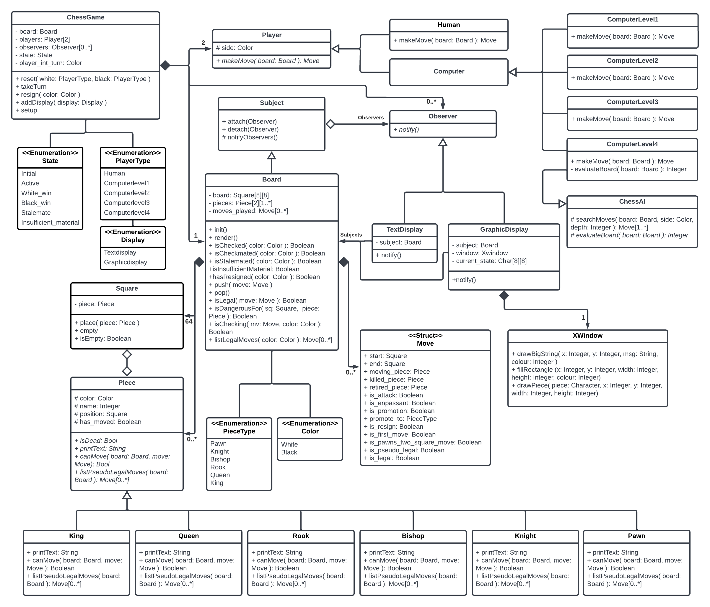

# cs246 chess

## UML

  
    <a href="docs/uml.png">UML Class Diagram</a>

## How to Run
### Requirements
- Install Xquarts for graphics 
For mac, try `g++14 window.cc graphicsdemo.cc -o graphicsdemo -lX11`
- Compile codes 
Makefile is included, try `make`
- Run the runfile 
`./chess`

### Commands
- `game [white-player] [black-player]` starts a new game. The parameters white-player and black-player
can be either human or computer[1-4].
- `resign` concedes the game to your opponent. This is the only way, outside of winning or drawing the game, to end a
game.
- `move [start-coordinate] [end-coordinate]` e.g. `move e2 e4`. Castling would specified by the two-square move for the king: move e1 g1 or move e1 c1 for white. Pawn promotion would additionally specify the piece type to which the pawn is promoted: move e7 e8 Q. In the case of a computer player, the command move (without arguments) makes the computer player make a move.
- `setup` enters setup mode, within which you can set up your own initial board configurations. This can only be done when a game is not currently running. Within setup mode, the following language is used:
   + `+ K e1` places the piece K (i.e., white king in this case) on the square e1. If a piece is already on that square, it is replaced. The board should be redisplayed.
   + `- e1` removes the piece from the square e1 and then redisplays the board. If there is no piece at that square, take no action.
   + `= colour` makes it colour’s turn to go next.
   + `done` leaves setup mode.
- `auto` sets computer players to automatically move its pieces
